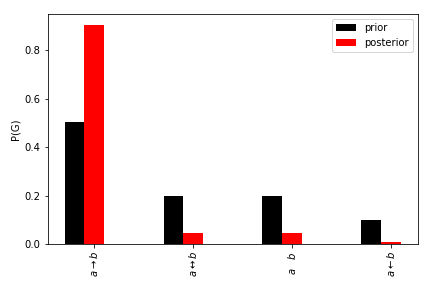
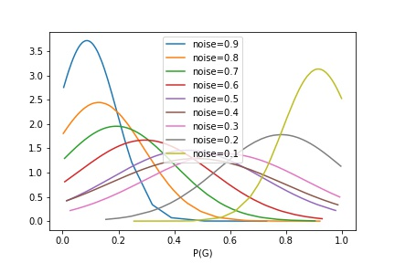

# Results from Other Simulations

## Smaller simulations (2 arguments)
The following shows the prior and posterior distribution for a view ({a,b}, 10) with an observation ((a->b),10)

## Three argument simulation
The following shows a number of simulations run on a view (({a,b},{c}),10) with different levels of noise. Each normal distribution relates to one of the levels of noise w.r.t to the graph (a-c->b). For each level of noise we generated 150 datasets and computed the posterior for the graph (a-c->b).

As can be clearly seen as the noise decreases there is an trend for the mean posterior probability to increase. Likewise the standard deviation also is smaller at both extremes (low noise and high noise).